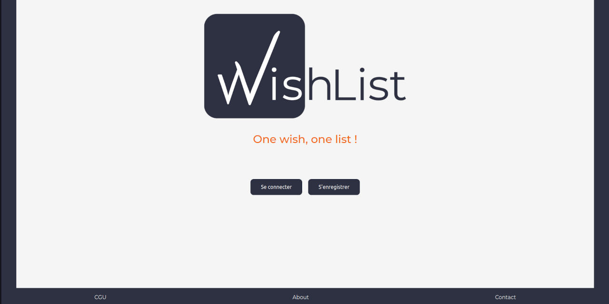

# WishList

## Introduction

WishList est une application web optimisée pour les appareils mobiles (mobile-first). Elle permet de créer des listes d’articles et d'importer leurs données depuis les sites marchands.

Application développée, en principe, pour un projet de fin d'études. Équipe de quatre développeurs (deux Back-End et deux Front-End).

---

## Versions

Les différentes versions de l'application ont été publiées pour montrer l'avancement de mon apprentissage/perfectionnement ; pour cela leur code doit servir **uniquement** comme point de comparaison avec les versions.

- **[WishList : API (Back) et Client (Front) v1 : Apothéose](./WishList_v1--Apotheose/)**
  - Avril -> Mai 2021
  - Back (API) :
    - développé par [Nicolas Bernard](https://github.com/Nicolas-B06) et [Thomas Paulo](https://github.com/gibsonshelby)
    - déployé sur [Heroku](https://onedream-onewish.herokuapp.com)
    - Dépôt original : [ICI](https://github.com/O-clock-Quill/projet-25-wishlist)
    - Technos : Node, Express, bcrypt, cors, joi, jsonwebtoken, PostgreSQL, SQL, redis, url-metadata, etc.
  - Front (CLient) :
    - développé par [Martin-GS](https://github.com/Martin-GS) et [Nicolas Benzadon](https://github.com/NicolasBNZ)
    - Technos : HTML, CSS, JavaScript, Sass/SCSS, React, React-Router, Axios, etc.
- **[WishList : client v2 : Titre Pro](https://github.com/Martin-GS/WishList_Client_v2--Titre_Pro )**
  - Mai -> Juillet 2021
  - Front (CLient) :
    - développé par [Martin-GS](https://github.com/Martin-GS)
    - Reprise, révision et optimisation du code.
    - Ligne graphique changée.
    - Implémentation du framework Bootstrap.
- **[WishList : client v3 : Clean code](https://github.com/Martin-GS/WishList_Client_v3--Clean_code )**
  - Juillet 2022
  - Front (Client) :
    - développé par [Martin-GS](https://github.com/Martin-GS)
    - Reprise, révision et optimisation du code.
    - Correction de bugs et de certaines fonctionnalités (login, cycle de vie des composants, etc).

---

## Previews

### WishList v1 : Apothéose

### WishList v2 : Titre Pro

### WishList v3 : Clean code

