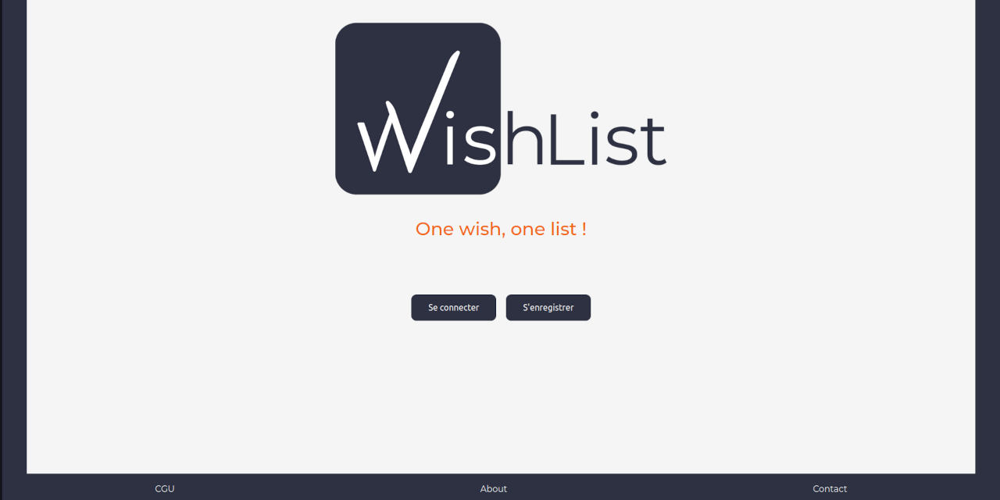

# WishList : Back (API) et Front (Client) v1 : Apothéose

## Note

> ⚠️ Cette version de l'application (v1) a été publiée pour montrer l'avancement de mon apprentissage/perfectionnement ; pour cela son code doit servir **uniquement** comme point de comparaison avec les versions 2 et 3. Pour plus d'informations se référer au fichier [README.md](../README.md) à la racine du projet.

## Preview

