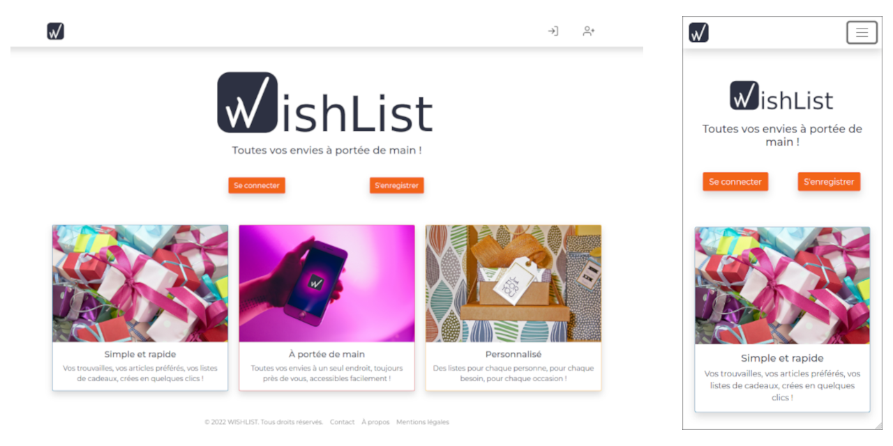

# WishList : client v3 : Clean Code

## Note

> ⚠️ Cette version de l'application (v3) a été publiée pour montrer l'avancement de mon apprentissage/perfectionnement ; pour cela son code doit servir **uniquement** comme point de comparaison avec les versions 1 et 2. Pour plus d'informations se référer au fichier [README.md](../README.md) à la racine du projet.

## Technos & Outils

### Technologies utilisées

- [HTML](https://www.w3.org/html/)
- [CSS](https://www.w3.org/Style/CSS/)
- [JavaScript](https://developer.mozilla.org/fr/docs/Web/JavaScript)
- [JSX](https://fr.reactjs.org/docs/introducing-jsx.html)
- [Create-React-Model](https://create-react-app.dev/)
- [React](https://reactjs.org/)
- [ReactDOM](https://fr.reactjs.org/docs/react-dom.html)
- [React Scripts](https://www.npmjs.com/package/react-scripts)
- [Web Vitals](https://www.npmjs.com/package/web-vitals)

### Scripts

> This project was bootstrapped with [Create React App](https://github.com/facebook/create-react-app).
> 
> #### Available Scripts
> 
> In the project directory, you can run:
> 
> ##### `npm start`
> 
> Runs the app in the development mode.\
> Open [http://localhost:3000](http://localhost:3000) to view it in your browser.
> 
> The page will reload when you make changes.\
> You may also see any lint errors in the console.
> 
> ##### `npm test`
> 
> Launches the test runner in the interactive watch mode.\
> See the section about [running tests](https://facebook.github.io/create-react-app/docs/running-tests) for more information.
> 
> ##### `npm run build`
> 
> Builds the app for production to the `build` folder.\
> It correctly bundles React in production mode and optimizes the build for the best performance.
> 
> The build is minified and the filenames include the hashes.\
> Your app is ready to be deployed!
> 
> See the section about [deployment](https://facebook.github.io/create-react-app/docs/deployment) for more information.
> 
> ##### `npm run eject`
> 
> **Note: this is a one-way operation. Once you `eject`, you can't go back!**
> 
> If you aren't satisfied with the build tool and configuration choices, you can `eject` at any time. This command will remove the single build dependency from your project.
> 
> Instead, it will copy all the configuration files and the transitive dependencies (webpack, Babel, ESLint, etc) right into your project so you have full control over them. All of the commands except `eject` will still work, but they will point to the copied scripts so you can tweak them. At this point you're on your own.
> 
> You don't have to ever use `eject`. The curated feature set is suitable for small and middle deployments, and you shouldn't feel obligated to use this feature. However we understand that this tool wouldn't be useful if you couldn't customize it when you are ready for it.

### manifest.json

[manifest.json](./wishlist_v3/../public/manifest.json) fournit les metadata qui sont utilisées lorsque l'application est installée sur un mobile ou un ordinateur.

Plus d'informations [ici](https://developer.mozilla.org/en-US/docs/Web/Manifest) et [là](https://developers.google.com/web/fundamentals/web-app-manifest/)

### .gitignore

Se référer à l'article [GitHub : "Ignoring files"](https://help.github.com/articles/ignoring-files/) pour plus d'information.

### Ajouter Bootstrap au projet

1. Exécuter `npm install react-bootstrap bootstrap`
2. Dans src/index.js  ajouter `import 'bootstrap/dist/css/bootstrap.min.css';`

- Pour plus d'information de référer à l'article [ajouter React-Bootstrap et Bootstrap au projet](https://react-bootstrap.github.io/getting-started/introduction)

### Ajouter Sass au projet

- Lien : [ajouter Sass au projet](https://create-react-app.dev/docs/adding-bootstrap/)

## Preview

